# PandasAI Chat Actual Flow Chart

This flow chart shows the actual implementation of `pai.chat` based on the real source code from your virtual environment.

## Complete Flow Visualization

```mermaid
graph TD
    %% Entry Point
    A[User calls sdf.chat] --> B[SmartDataframe.chat]
    
    %% Initial Validation
    B --> C[Agent.chat]
    C --> D{LLM Configured?}
    D -->|No| E[Raise ValueError]
    D -->|Yes| F[start_new_conversation]
    
    %% Query Processing
    F --> G[_process_query]
    G --> H[UserQuery query]
    H --> I[Log Question]
    I --> J[Log Running PandasAI]
    
    %% Code Generation Phase
    J --> K[assign_prompt_id]
    K --> L[generate_code_with_retries]
    
    L --> M[generate_code]
    M --> N[memory.add query]
    N --> O[Log Generating new code]
    O --> P[get_chat_prompt_for_sql]
    P --> Q[_code_generator.generate_code]
    Q --> R[last_prompt_used = prompt]
    
    %% Code Generation Success Check
    R --> S{Code Generation Success?}
    S -->|No| T[Exception caught]
    T --> U[attempts = 0]
    U --> V{attempts <= max_retries?}
    V -->|No| W[Log Maximum retry attempts exceeded]
    V -->|Yes| X[_regenerate_code_after_error]
    X --> Y[attempts++]
    Y --> V
    
    %% Code Execution Phase
    S -->|Yes| Z[execute_with_retries]
    
    Z --> AA[execute_code]
    AA --> BB[Log Executing code]
    BB --> CC[CodeExecutor state.config]
    CC --> DD[add_to_env execute_sql_query]
    
    %% Sandbox Execution
    DD --> EE{Sandbox Available?}
    EE -->|Yes| FF[sandbox.execute code environment]
    EE -->|No| GG[execute_and_return_result]
    
    %% Response Processing
    FF --> HH[ResponseParser.parse result code]
    GG --> HH
    
    %% Execution Success Check
    HH --> II{Execution Success?}
    II -->|No| JJ[Exception caught]
    JJ --> KK[attempts = 0]
    KK --> LL{attempts <= max_retries?}
    LL -->|No| MM[Log Max retries reached]
    LL -->|Yes| NN[_regenerate_code_after_error code error]
    NN --> OO[attempts++]
    OO --> LL
    
    %% Success Path
    II -->|Yes| PP[Log Response generated successfully]
    PP --> QQ[Return result to user]
    
    %% Styling - All boxes with black background and white text
    style A fill:#000000,stroke:#ffffff,color:#ffffff
    style B fill:#000000,stroke:#ffffff,color:#ffffff
    style C fill:#000000,stroke:#ffffff,color:#ffffff
    style D fill:#000000,stroke:#ffffff,color:#ffffff
    style E fill:#000000,stroke:#ffffff,color:#ffffff
    style F fill:#000000,stroke:#ffffff,color:#ffffff
    style G fill:#000000,stroke:#ffffff,color:#ffffff
    style H fill:#000000,stroke:#ffffff,color:#ffffff
    style I fill:#000000,stroke:#ffffff,color:#ffffff
    style J fill:#000000,stroke:#ffffff,color:#ffffff
    style K fill:#000000,stroke:#ffffff,color:#ffffff
    style L fill:#000000,stroke:#ffffff,color:#ffffff
    style M fill:#000000,stroke:#ffffff,color:#ffffff
    style N fill:#000000,stroke:#ffffff,color:#ffffff
    style O fill:#000000,stroke:#ffffff,color:#ffffff
    style P fill:#000000,stroke:#ffffff,color:#ffffff
    style Q fill:#000000,stroke:#ffffff,color:#ffffff
    style R fill:#000000,stroke:#ffffff,color:#ffffff
    style S fill:#000000,stroke:#ffffff,color:#ffffff
    style T fill:#000000,stroke:#ffffff,color:#ffffff
    style U fill:#000000,stroke:#ffffff,color:#ffffff
    style V fill:#000000,stroke:#ffffff,color:#ffffff
    style W fill:#000000,stroke:#ffffff,color:#ffffff
    style X fill:#000000,stroke:#ffffff,color:#ffffff
    style Y fill:#000000,stroke:#ffffff,color:#ffffff
    style Z fill:#000000,stroke:#ffffff,color:#ffffff
    style AA fill:#000000,stroke:#ffffff,color:#ffffff
    style BB fill:#000000,stroke:#ffffff,color:#ffffff
    style CC fill:#000000,stroke:#ffffff,color:#ffffff
    style DD fill:#000000,stroke:#ffffff,color:#ffffff
    style EE fill:#000000,stroke:#ffffff,color:#ffffff
    style FF fill:#000000,stroke:#ffffff,color:#ffffff
    style GG fill:#000000,stroke:#ffffff,color:#ffffff
    style HH fill:#000000,stroke:#ffffff,color:#ffffff
    style II fill:#000000,stroke:#ffffff,color:#ffffff
    style JJ fill:#000000,stroke:#ffffff,color:#ffffff
    style KK fill:#000000,stroke:#ffffff,color:#ffffff
    style LL fill:#000000,stroke:#ffffff,color:#ffffff
    style MM fill:#000000,stroke:#ffffff,color:#ffffff
    style NN fill:#000000,stroke:#ffffff,color:#ffffff
    style OO fill:#000000,stroke:#ffffff,color:#ffffff
    style PP fill:#000000,stroke:#ffffff,color:#ffffff
    style QQ fill:#000000,stroke:#ffffff,color:#ffffff
```



## Detailed Step Breakdown

### **Step 1: Entry Point**
```
User calls: sdf.chat('What is the total sales amount?')
├── SmartDataframe.chat() - Delegates to Agent
└── return self._agent.chat(query, output_type)
```

### **Step 2: Agent Validation**
```
Agent.chat()
├── Check if LLM is configured
├── If not: Raise ValueError with helpful message
├── start_new_conversation() - Clear previous conversation
└── return self._process_query(query, output_type)
```

### **Step 3: Query Processing**
```
_process_query()
├── query = UserQuery(query) - Wrap query
├── Log: 'Question: What is the total sales amount?'
├── Log: 'Running PandasAI with {llm.type} LLM...'
├── self._state.output_type = output_type
├── self._state.assign_prompt_id()
├── code = self.generate_code_with_retries(query)
├── result = self.execute_with_retries(code)
├── Log: 'Response generated successfully.'
└── return result
```

### **Step 4: Code Generation with Retries**
```
generate_code_with_retries(query)
├── max_retries = self._state.config.max_retries
├── attempts = 0
├── Try: return self.generate_code(query)
├── If Exception:
│   ├── while attempts <= max_retries:
│   │   ├── Try: _regenerate_code_after_error()
│   │   ├── If Exception: attempts++
│   │   ├── If attempts > max_retries: Log and raise
│   │   └── Log: 'Retrying Code Generation ({attempts}/{max_retries})...'
│   └── return None
└── Return generated code
```

### **Step 5: Code Generation**
```
generate_code(query)
├── self._state.memory.add(str(query), is_user=True)
├── Log: 'Generating new code...'
├── prompt = get_chat_prompt_for_sql(self._state)
├── code = self._code_generator.generate_code(prompt)
├── self._state.last_prompt_used = prompt
└── return code
```

### **Step 6: Code Execution with Retries**
```
execute_with_retries(code)
├── max_retries = self._state.config.max_retries
├── attempts = 0
├── while attempts <= max_retries:
│   ├── Try: result = self.execute_code(code)
│   ├── Try: return self._response_parser.parse(result, code)
│   ├── If Exception:
│   │   ├── attempts++
│   │   ├── If attempts > max_retries: Log and raise
│   │   ├── Log: 'Retrying execution ({attempts}/{max_retries})...'
│   │   └── code = self._regenerate_code_after_error(code, e)
│   └── return None
└── Return parsed result
```

### **Step 7: Code Execution**
```
execute_code(code)
├── Log: 'Executing code: {code}'
├── code_executor = CodeExecutor(self._state.config)
├── code_executor.add_to_env('execute_sql_query', self._execute_sql_query)
├── If self._sandbox:
│   └── return self._sandbox.execute(code, code_executor.environment)
├── Else:
│   └── return code_executor.execute_and_return_result(code)
└── Return execution result
```

## Key Features of Actual Implementation

### **1. Robust Error Handling**
- **LLM Validation**: Checks if LLM is configured before processing
- **Retry Logic**: Both code generation and execution have retry mechanisms
- **Exception Recovery**: Can regenerate code when errors occur
- **Graceful Degradation**: Returns error responses instead of crashing

### **2. State Management**
- **Memory Management**: Maintains conversation history
- **Prompt ID Assignment**: Tracks each interaction
- **Output Type Handling**: Supports different response types
- **Logging**: Comprehensive logging throughout the process

### **3. Security Features**
- **Sandbox Execution**: Optional sandbox for secure code execution
- **Environment Isolation**: Code runs in isolated environment
- **SQL Query Safety**: Special handling for SQL queries

### **4. Production Features**
- **Retry Mechanisms**: Configurable retry attempts for reliability
- **Response Parsing**: Dedicated parser for formatting results
- **Code Generation**: Uses dedicated CodeGenerator class
- **Code Execution**: Uses dedicated CodeExecutor class

## Method Call Sequence

```
sdf.chat("What is the total sales amount?")
├── SmartDataframe.chat() - Entry point
│   └── return self._agent.chat(query, output_type)
├── Agent.chat() - Main method with validation
│   ├── Check LLM configuration
│   ├── self.start_new_conversation()
│   └── return self._process_query(query, output_type)
├── Agent._process_query() - Core processing
│   ├── query = UserQuery(query)
│   ├── self._state.assign_prompt_id()
│   ├── code = self.generate_code_with_retries(query)
│   ├── result = self.execute_with_retries(code)
│   └── return result
├── Agent.generate_code_with_retries() - Code generation with retries
│   ├── self.generate_code(query)
│   ├── self._state.memory.add(str(query), is_user=True)
│   ├── prompt = get_chat_prompt_for_sql(self._state)
│   ├── code = self._code_generator.generate_code(prompt)
│   └── self._state.last_prompt_used = prompt
└── Agent.execute_with_retries() - Code execution with retries
    ├── self.execute_code(code)
    ├── code_executor = CodeExecutor(self._state.config)
    ├── result = code_executor.execute_and_return_result(code)
    └── return self._response_parser.parse(result, code)
```

This flow chart shows the complete journey from your simple query to the final response, including all the sophisticated error handling, retry logic, and security measures that make PandasAI production-ready! 