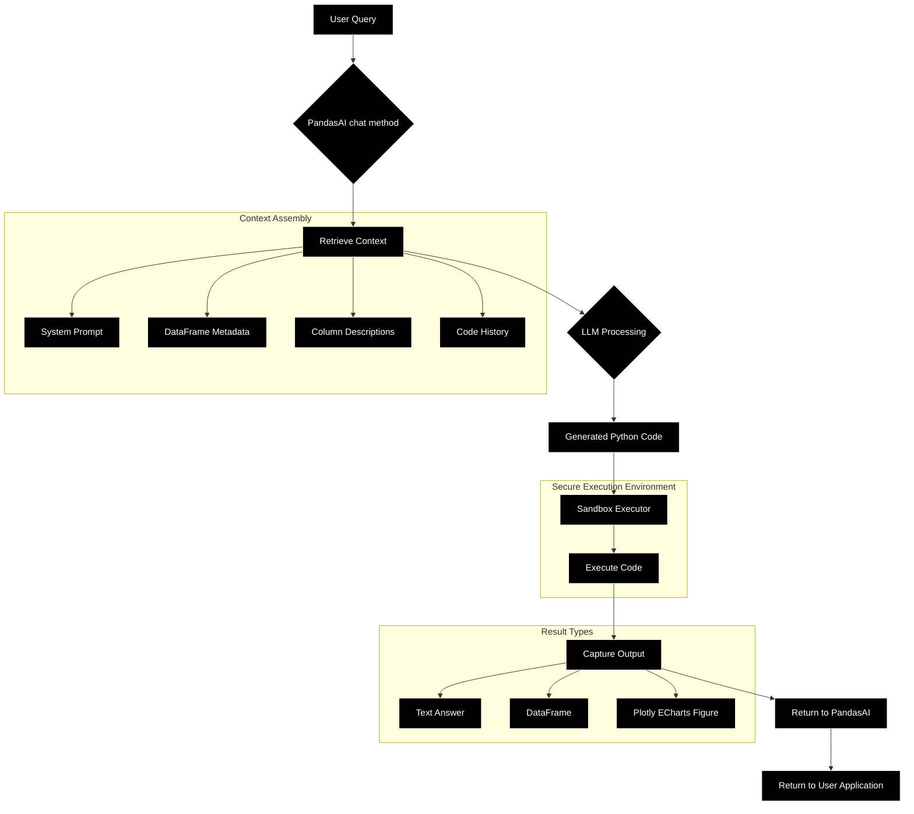
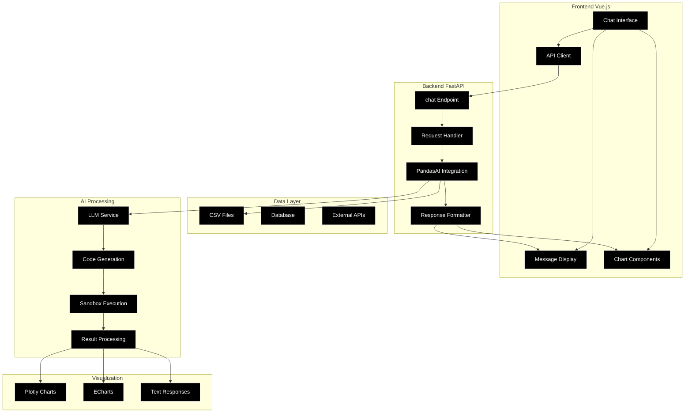

# Chat2BI Application Development Guide

A comprehensive 7-day development plan for building a "chat-to-BI" application that transforms natural language queries into business intelligence insights and visualizations.

## 📋 Table of Contents

- [Overview](#overview)
- [Prerequisites](#prerequisites)
- [The 7-Day Development Plan](#the-7-day-development-plan)
  - [Day 1: PandasAI Foundations](#day-1-pandasai-foundations)
  - [Day 2: FastAPI & Vue.js Foundations](#day-2-fastapi--vuejs-foundations)
  - [Day 3: Backend Integration](#day-3-backend-integration)
  - [Day 4: Visualization Output](#day-4-visualization-output)
  - [Day 5: Frontend Integration](#day-5-frontend-integration)
  - [Day 6: Alternative Visualizations](#day-6-alternative-visualizations)
  - [Day 7: Advanced Topics](#day-7-advanced-topics)
- [System Architecture](#system-architecture)
- [Prompting Template](#prompting-template)
- [Learning Resources](#learning-resources)

## 🎯 Overview

This guide provides a structured approach to building a Chat2BI application that combines:
- **PandasAI**: Natural language processing for data analysis
- **FastAPI**: High-performance backend API
- **Vue.js**: Modern frontend framework
- **Plotly/ECharts**: Interactive data visualizations

The application allows users to ask questions in natural language and receive both textual insights and interactive charts.

## 🔧 Prerequisites

- Python 3.8+
- Node.js 16+
- Basic knowledge of Python, JavaScript, and web development
- An OpenAI API key (or compatible LLM provider)

---

## 📅 The 7-Day Development Plan

This plan is structured to provide foundational knowledge before integrating the technologies into a single, working application.

### Day 1: PandasAI Foundations

**Objective:** Understand the core concepts and internal architecture of PandasAI.

**Key Tasks:**

1. **Introduction:**
   - What is PandasAI? Its purpose, key features, and the difference between a regular Pandas `DataFrame` and a `SmartDataframe`.
2. **Environment Setup:**
   - Create a Python virtual environment and install `pandasai` and `pandas`.
3. **Basic Interaction:**
   - Write a simple Python script to load data into a `SmartDataframe` and perform a text-based query.

**PandasAI Engine Architecture:**

This diagram illustrates the internal workflow of PandasAI, from a user query to the generated Python code and final result.



**Learning Resources:**
- **Official Documentation:** [https://docs.pandas-ai.com/](https://docs.pandas-ai.com/) - Start with the **"Getting Started"** section.

### Day 2: FastAPI & Vue.js Foundations

**Objective:** Learn the basics of the backend and frontend frameworks.

**Key Tasks:**

1. **FastAPI Tutorial:**
   - What is FastAPI? Install `fastapi` and `uvicorn`, and create a simple "Hello, World!" API endpoint.
   - Learn how to create a POST endpoint that accepts a JSON body.
2. **Vue.js Tutorial:**
   - What is Vue.js? Install Node.js and the Vue CLI.
   - Create a basic Vue project and learn how to make a simple API call to a backend endpoint.

**Learning Resources:**
- **FastAPI Documentation:** [https://fastapi.tiangolo.com/](https://fastapi.tiangolo.com/) - The **"Tutorial - User Guide"** is a comprehensive, step-by-step guide.
- **Vue.js Documentation:** [https://vuejs.org/guide/introduction.html](https://vuejs.org/guide/introduction.html) - Begin with the **"Essentials"** section to learn core concepts.

### Day 3: Backend Integration (PandasAI + FastAPI)

**Objective:** Combine the knowledge from Day 1 and Day 2 to create a functional backend that processes queries with PandasAI.

**Key Tasks:**

1. **Project Setup:**
   - Install all necessary backend libraries (`fastapi`, `uvicorn`, `pandasai`, `pandas`).
   - Create a `sample_data.csv` file.
2. **FastAPI Backend (`main.py`):**
   - Create a `FastAPI` application.
   - Load the CSV into a Pandas `DataFrame` and define `column_descriptions`.
   - Initialize `SmartDataframe` with your data and descriptions.
   - Create a `/chat` endpoint that receives user queries.
   - Use `sdf.chat(user_query)` to process the query.
   - Return a simple JSON response with `{"type": "text", "content": "..."}`.

### Day 4: Visualization Output (Plotly JSON)

**Objective:** Extend the backend to generate and return Plotly visualizations as JSON.

**Key Tasks:**

1. **Install Plotly:**
   - Install `plotly` in your Python environment.
2. **Update FastAPI Endpoint:**
   - Import `plotly.graph_objects` to check the type of PandasAI's response.
   - If the response is a Plotly `Figure`, serialize it to a JSON string using `response.to_json()`.
   - Return a structured JSON response: `{"type": "plotly_json", "content": {...}}`.

### Day 5: Frontend Integration (Vue.js + Plotly)

**Objective:** Build the Vue.js frontend to interact with the backend and render charts.

**Key Tasks:**

1. **Vue.js Project Setup:**
   - Install a Plotly wrapper for Vue, like `vue-plotly`.
2. **Chat Interface Component:**
   - Create a main Vue component that manages the chat state.
   - Implement logic to send queries to the FastAPI `/chat` endpoint.
   - Display chat messages from both the user and the AI.
3. **Dynamic Rendering:**
   - Use `v-if` or a similar conditional rendering pattern to check the `type` field of the backend response.
   - If `type` is `plotly_json`, pass the `content` to your Plotly chart component.

### Day 6: Alternative Visualizations (ECharts)

**Objective:** Add ECharts as an alternative visualization output, demonstrating how to switch between charting libraries based on user intent.

**Key Tasks:**

1. **Install Pyecharts:**
   - Install `pyecharts` in your Python environment.
2. **Update PandasAI Prompting:**
   - Adjust the PandasAI system prompt to instruct the LLM to use `pyecharts` when the user explicitly requests "ECharts".
3. **Update FastAPI Endpoint:**
   - Import `pyecharts.charts.base.Base` to check for Pyecharts chart objects.
   - If the response is a Pyecharts object, convert it to JSON using `pyecharts_object.dump_options()`.
   - Return a structured JSON response: `{"type": "echarts_json", "content": {...}}`.

### Day 7: Advanced Topics, Sandbox, & The Prompting Template

**Objective:** Cover advanced configurations, security, and deployment, and delve into the critical role of the prompting template.

**Key Tasks:**

1. **Sandbox Implementation:**
   - Install `pandasai-docker` and integrate it to securely execute LLM-generated code.
2. **Debugging and Advanced Features:**
   - Use the PandasAI `logger` and `verbose=True` for debugging.
   - Introduce `SmartDatalake` for multiple data sources and `custom_whitelisted_dependencies`.
3. **The Prompting Template:**
   - Understand how PandasAI constructs the prompt sent to the LLM.

---

## 🏗️ System Architecture

The complete Chat2BI application architecture:



---

## 📝 Prompting Template

**What the LLM Actually Sees**

This is the structured text that PandasAI creates internally. Understanding its components is key to refining the LLM's behavior.

```text
### Instructions

You are a Python data analyst assistant. Your task is to write a single, clean Python script to answer the user's question using the provided DataFrame `df`.

- You have access to the following dependencies: pandas, plotly.express, pyecharts.charts.
- The user has provided column descriptions. Use them to better understand the data.
- The final result should be assigned to the `result` variable.
- Do not add comments or extra explanations.
- You can only use the variable `df` which is already loaded.

### Data
The DataFrame `df` has the following structure:
<dataframe_head>
   OrderID  CustomerID  ProductCategory  SalesAmount  OrderDate Region
0        1        C001      Electronics      1200.50 2024-01-15   East
1        2        C002         Clothing        75.20 2024-01-16   West
...
</dataframe_head>

Column Descriptions:
- OrderID: A unique identifier for each sales order.
- CustomerID: Identifier for the customer who placed the order.
- ProductCategory: The category of the product sold.
- SalesAmount: The monetary value of the sale in USD.
- OrderDate: The date when the order was placed.
- Region: The geographical region where the sale occurred.

### Previous Conversation

<if_history_exists>
Previous Code:
```python
print(df['SalesAmount'].sum())
```

Result: 4506.45
</if_history_exists>

### User Query

<user_query>
Show me a bar chart of sales amount by product category.
</user_query>

### Generated Python Code

```python
# The LLM's generated code will be filled in here.
```
```

---

## 📚 Learning Resources

### Core Technologies
- **[PandasAI Documentation](https://docs.pandas-ai.com/)** - Official guide and API reference
- **[FastAPI Documentation](https://fastapi.tiangolo.com/)** - Modern Python web framework
- **[Vue.js Documentation](https://vuejs.org/guide/introduction.html)** - Progressive JavaScript framework

### Visualization Libraries
- **[Plotly Python](https://plotly.com/python/)** - Interactive plotting library
- **[Pyecharts](https://pyecharts.org/)** - Python interface for ECharts

### Additional Resources
- **[OpenAI API Documentation](https://platform.openai.com/docs)** - For LLM integration
- **[Docker Documentation](https://docs.docker.com/)** - For sandbox implementation

---

## 🚀 Getting Started

1. **Clone this repository**
2. **Follow the 7-day development plan** starting with Day 1
3. **Set up your environment** with the required dependencies
4. **Configure your API keys** for the LLM service
5. **Run the application** and start chatting with your data!

---

*This guide provides a comprehensive foundation for building intelligent data analysis applications that bridge the gap between natural language and business intelligence.*
