# Chat2BI 应用程序开发指南

一个全面的7天开发计划，用于构建"聊天到商业智能"应用程序，将自然语言查询转换为商业智能洞察和可视化。

## 📋 目录

- [概述](#概述)
- [先决条件](#先决条件)
- [7天开发计划](#7天开发计划)
  - [第1天：PandasAI基础](#第1天pandasai基础)
  - [第2天：FastAPI和Vue.js基础](#第2天fastapi和vuejs基础)
  - [第3天：后端集成](#第3天后端集成)
  - [第4天：可视化输出](#第4天可视化输出)
  - [第5天：前端集成](#第5天前端集成)
  - [第6天：替代可视化](#第6天替代可视化)
  - [第7天：高级主题](#第7天高级主题)
- [系统架构](#系统架构)
- [提示模板](#提示模板)
- [学习资源](#学习资源)

## 🎯 概述

本指南提供了构建Chat2BI应用程序的结构化方法，该应用程序结合了：
- **PandasAI**：用于数据分析的自然语言处理
- **FastAPI**：高性能后端API
- **Vue.js**：现代前端框架
- **Plotly/ECharts**：交互式数据可视化

该应用程序允许用户用自然语言提问，并获得文本洞察和交互式图表。

## 🔧 先决条件

- Python 3.8+
- Node.js 16+
- Python、JavaScript和Web开发的基础知识
- Azure OpenAI API密钥（或兼容的LLM提供商）

## 🚀 快速开始

### 1. 克隆仓库
```bash
git clone <repository-url>
cd ecc_chat2bi
```

### 2. 安装依赖
```bash
# 安装Python依赖
pip install -r requirements.txt

# 或者创建虚拟环境（推荐）
python -m venv venv_chat2bi
source venv_chat2bi/bin/activate  # Linux/Mac
# 或 venv_chat2bi\Scripts\activate  # Windows
pip install -r requirements.txt
```

### 3. 设置环境变量
```bash
# 设置Azure OpenAI配置
export AZURE_OPENAI_API_KEY="your_api_key"
export AZURE_OPENAI_ENDPOINT="https://your-resource.openai.azure.com/"
export AZURE_OPENAI_DEPLOYMENT="your_deployment_name"
export AZURE_OPENAI_API_VERSION="2024-02-15-preview"
```

---

## 📊 第1天预期输出

运行第1天的示例后，您应该看到：

### 从 `pandasAI.py` 的输出：
```
=== PandasAI聊天示例与提示检查 ===

==================================================
查询1：总销售额是多少？
==================================================
响应：总销售额是$2,292.44

==================================================
查询2：按产品类别显示销售情况
==================================================
响应：[按类别显示销售的数据框]

==================================================
查询3：哪个地区的平均销售额最高？
==================================================
响应：北部地区的平均销售额最高...

=== 示例结束 ===

==================================================
提示模板检查
==================================================
默认PandasAI提示模板结构：
------------------------------
### 指令
您是一个Python数据分析助手...
```

### 从 `prompt_inspector.py` 的输出：
```
=== PANDASAI提示检查器 ===
此脚本将显示发送给LLM的实际提示

=== 发送查询以查看提示 ===
查询：'总销售额是多少？'
==================================================

[显示实际提示的详细日志输出]

最终响应：总销售额是$2,292.44

==================================================
提示模板结构
==================================================
默认PandasAI提示模板：
------------------------------
### 指令
您是一个Python数据分析助手...
```

---

## 📅 7天开发计划

该计划旨在在将技术集成到单个工作应用程序之前提供基础知识。

### 第1天：PandasAI基础

**目标：** 理解PandasAI的核心概念和内部架构。

**主要任务：**

1. **介绍：**
   - 什么是PandasAI？其目的、主要功能，以及常规Pandas `DataFrame`和`SmartDataframe`之间的区别。
2. **环境设置：**
   - 创建Python虚拟环境并安装`pandasai`和`pandas`。
3. **基本交互：**
   - 编写简单的Python脚本，将数据加载到`SmartDataframe`中并执行基于文本的查询。

**🎯 第1天具体工作步骤：**

1. **进入第1天目录：**
   ```bash
   cd 7_days_plan/day_1
   ```

2. **运行基础示例：**
   ```bash
   # 运行主要的PandasAI示例
   python pandasAI.py
   ```

3. **检查提示模板：**
   ```bash
   # 运行提示检查器以了解PandasAI如何工作
   python prompt_inspector.py
   ```

4. **查看实际源代码：**
   ```bash
   # 查看PandasAI的实际开源代码
   python pandasai_actual_source_code.py
   ```

**📁 第1天文件说明：**
- `pandasAI.py` - 主要的PandasAI聊天实现
- `prompt_inspector.py` - 高级提示分析工具
- `pandasai_actual_source_code.py` - 显示真实的PandasAI源代码

**🔍 学习要点：**
- 理解SmartDataframe与普通DataFrame的区别
- 学习如何配置Azure OpenAI集成
- 查看发送给LLM的实际提示
- 了解PandasAI的内部架构和工作流程

**📊 PandasAI实际流程图表：**

以下是当您调用 `sdf.chat("What is the total sales amount?")` 时发生的完整流程：

```mermaid
graph TD
    %% Entry Point
    A[User calls sdf.chat] --> B[SmartDataframe.chat]
    
    %% Initial Validation
    B --> C[Agent.chat]
    C --> D{LLM Configured?}
    D -->|No| E[Raise ValueError]
    D -->|Yes| F[start_new_conversation]
    
    %% Query Processing
    F --> G[_process_query]
    G --> H[UserQuery query]
    H --> I[Log Question]
    I --> J[Log Running PandasAI]
    
    %% Code Generation Phase
    J --> K[assign_prompt_id]
    K --> L[generate_code_with_retries]
    
    L --> M[generate_code]
    M --> N[memory.add query]
    N --> O[Log Generating new code]
    O --> P[get_chat_prompt_for_sql]
    P --> Q[_code_generator.generate_code]
    Q --> R[last_prompt_used = prompt]
    
    %% Code Generation Success Check
    R --> S{Code Generation Success?}
    S -->|No| T[Exception caught]
    T --> U[attempts = 0]
    U --> V{attempts <= max_retries?}
    V -->|No| W[Log Maximum retry attempts exceeded]
    V -->|Yes| X[_regenerate_code_after_error]
    X --> Y[attempts++]
    Y --> V
    
    %% Code Execution Phase
    S -->|Yes| Z[execute_with_retries]
    
    Z --> AA[execute_code]
    AA --> BB[Log Executing code]
    BB --> CC[CodeExecutor state.config]
    CC --> DD[add_to_env execute_sql_query]
    
    %% Sandbox Execution
    DD --> EE{Sandbox Available?}
    EE -->|Yes| FF[sandbox.execute code environment]
    EE -->|No| GG[execute_and_return_result]
    
    %% Response Processing
    FF --> HH[ResponseParser.parse result code]
    GG --> HH
    
    %% Execution Success Check
    HH --> II{Execution Success?}
    II -->|No| JJ[Exception caught]
    JJ --> KK[attempts = 0]
    KK --> LL{attempts <= max_retries?}
    LL -->|No| MM[Log Max retries reached]
    LL -->|Yes| NN[_regenerate_code_after_error code error]
    NN --> OO[attempts++]
    OO --> LL
    
    %% Success Path
    II -->|Yes| PP[Log Response generated successfully]
    PP --> QQ[Return result to user]
    
    %% Styling - All boxes with black background and white text
    style A fill:#000000,stroke:#ffffff,color:#ffffff
    style B fill:#000000,stroke:#ffffff,color:#ffffff
    style C fill:#000000,stroke:#ffffff,color:#ffffff
    style D fill:#000000,stroke:#ffffff,color:#ffffff
    style E fill:#000000,stroke:#ffffff,color:#ffffff
    style F fill:#000000,stroke:#ffffff,color:#ffffff
    style G fill:#000000,stroke:#ffffff,color:#ffffff
    style H fill:#000000,stroke:#ffffff,color:#ffffff
    style I fill:#000000,stroke:#ffffff,color:#ffffff
    style J fill:#000000,stroke:#ffffff,color:#ffffff
    style K fill:#000000,stroke:#ffffff,color:#ffffff
    style L fill:#000000,stroke:#ffffff,color:#ffffff
    style M fill:#000000,stroke:#ffffff,color:#ffffff
    style N fill:#000000,stroke:#ffffff,color:#ffffff
    style O fill:#000000,stroke:#ffffff,color:#ffffff
    style P fill:#000000,stroke:#ffffff,color:#ffffff
    style Q fill:#000000,stroke:#ffffff,color:#ffffff
    style R fill:#000000,stroke:#ffffff,color:#ffffff
    style S fill:#000000,stroke:#ffffff,color:#ffffff
    style T fill:#000000,stroke:#ffffff,color:#ffffff
    style U fill:#000000,stroke:#ffffff,color:#ffffff
    style V fill:#000000,stroke:#ffffff,color:#ffffff
    style W fill:#000000,stroke:#ffffff,color:#ffffff
    style X fill:#000000,stroke:#ffffff,color:#ffffff
    style Y fill:#000000,stroke:#ffffff,color:#ffffff
    style Z fill:#000000,stroke:#ffffff,color:#ffffff
    style AA fill:#000000,stroke:#ffffff,color:#ffffff
    style BB fill:#000000,stroke:#ffffff,color:#ffffff
    style CC fill:#000000,stroke:#ffffff,color:#ffffff
    style DD fill:#000000,stroke:#ffffff,color:#ffffff
    style EE fill:#000000,stroke:#ffffff,color:#ffffff
    style FF fill:#000000,stroke:#ffffff,color:#ffffff
    style GG fill:#000000,stroke:#ffffff,color:#ffffff
    style HH fill:#000000,stroke:#ffffff,color:#ffffff
    style II fill:#000000,stroke:#ffffff,color:#ffffff
    style JJ fill:#000000,stroke:#ffffff,color:#ffffff
    style KK fill:#000000,stroke:#ffffff,color:#ffffff
    style LL fill:#000000,stroke:#ffffff,color:#ffffff
    style MM fill:#000000,stroke:#ffffff,color:#ffffff
    style NN fill:#000000,stroke:#ffffff,color:#ffffff
    style OO fill:#000000,stroke:#ffffff,color:#ffffff
    style PP fill:#000000,stroke:#ffffff,color:#ffffff
    style QQ fill:#000000,stroke:#ffffff,color:#ffffff
```



**🔍 实际源代码洞察：**

实际的PandasAI源代码揭示了一个复杂的架构：

#### **1. 基于代理的架构：**
```python
# SmartDataframe将任务委托给Agent
def chat(self, query: str, output_type: Optional[str] = None):
    return self._agent.chat(query, output_type)
```

#### **2. 复杂的错误处理：**
```python
# 代码生成和执行的重试逻辑
def generate_code_with_retries(self, query: str) -> Any:
    max_retries = self._state.config.max_retries
    # ... 重试逻辑和错误恢复
```

#### **3. 状态管理：**
```python
# 使用AgentState管理对话状态
self._state.assign_prompt_id()
self._state.memory.add(str(query), is_user=True)
```

#### **4. 代码生成与执行：**
```python
# 使用专门的类进行代码生成和执行
code = self._code_generator.generate_code(prompt)
result = self._response_parser.parse(result, code)
```

**主要特点：**
- **代理类**: 使用专门的Agent而不是直接方法
- **重试逻辑**: 代码生成和执行的复杂重试机制
- **错误恢复**: 当错误发生时可以重新生成代码
- **状态管理**: 使用AgentState进行对话管理
- **代码生成**: 使用专门的CodeGenerator类
- **代码执行**: 使用专门的CodeExecutor类，支持沙盒
- **响应解析**: 使用ResponseParser格式化结果
- **内存管理**: 适当的对话历史管理
- **日志记录**: 整个过程的综合日志记录

**PandasAI引擎架构：**

此图说明了PandasAI的内部工作流程，从用户查询到生成的Python代码和最终结果。


**学习资源：**
- **官方文档：** [https://docs.pandas-ai.com/](https://docs.pandas-ai.com/) - 从**"开始使用"**部分开始。

**🔧 第1天常见问题解决：**

1. **Azure OpenAI配置错误：**
   ```bash
   # 确保环境变量正确设置
   echo $AZURE_OPENAI_API_KEY
   echo $AZURE_OPENAI_ENDPOINT
   ```

2. **依赖安装问题：**
   ```bash
   # 重新安装依赖
   pip install --upgrade pandasai pandasai-openai
   ```

3. **虚拟环境激活：**
   ```bash
   # 确保在正确的虚拟环境中
   source venv_chat2bi/bin/activate
   which python
   ```

4. **查看详细日志：**
   ```bash
   # 在pandasAI.py中启用详细日志
   # 设置 verbose=True 和 enable_logging=True
   ```

### 第2天：FastAPI和Vue.js基础

**目标：** 学习后端和前端框架的基础知识。

**主要任务：**

1. **FastAPI教程：**
   - 什么是FastAPI？安装`fastapi`和`uvicorn`，并创建一个简单的"Hello, World!" API端点。
   - 学习如何创建接受JSON正文的POST端点。
2. **Vue.js教程：**
   - 什么是Vue.js？安装Node.js和Vue CLI。
   - 创建基本的Vue项目并学习如何向后端端点发出简单的API调用。

**学习资源：**
- **FastAPI文档：** [https://fastapi.tiangolo.com/](https://fastapi.tiangolo.com/) - **"教程-用户指南"**是一个全面的分步指南。
- **Vue.js文档：** [https://vuejs.org/guide/introduction.html](https://vuejs.org/guide/introduction.html) - 从**"基础"**部分开始学习核心概念。

### 第3天：后端集成（PandasAI + FastAPI）

**目标：** 结合第1天和第2天的知识，创建一个使用PandasAI处理查询的功能性后端。

**主要任务：**

1. **项目设置：**
   - 安装所有必要的后端库（`fastapi`、`uvicorn`、`pandasai`、`pandas`）。
   - 创建`sample_data.csv`文件。
2. **FastAPI后端（`main.py`）：**
   - 创建`FastAPI`应用程序。
   - 将CSV加载到Pandas `DataFrame`中并定义`column_descriptions`。
   - 使用您的数据和描述初始化`SmartDataframe`。
   - 创建接收用户查询的`/chat`端点。
   - 使用`sdf.chat(user_query)`处理查询。
   - 返回简单的JSON响应：`{"type": "text", "content": "..."}`。

### 第4天：可视化输出（Plotly JSON）

**目标：** 扩展后端以生成并返回Plotly可视化作为JSON。

**主要任务：**

1. **安装Plotly：**
   - 在Python环境中安装`plotly`。
2. **更新FastAPI端点：**
   - 导入`plotly.graph_objects`以检查PandasAI响应的类型。
   - 如果响应是Plotly `Figure`，使用`response.to_json()`将其序列化为JSON字符串。
   - 返回结构化JSON响应：`{"type": "plotly_json", "content": {...}}`。

### 第5天：前端集成（Vue.js + Plotly）

**目标：** 构建Vue.js前端以与后端交互并渲染图表。

**主要任务：**

1. **Vue.js项目设置：**
   - 为Vue安装Plotly包装器，如`vue-plotly`。
2. **聊天界面组件：**
   - 创建管理聊天状态的主Vue组件。
   - 实现向FastAPI `/chat`端点发送查询的逻辑。
   - 显示来自用户和AI的聊天消息。
3. **动态渲染：**
   - 使用`v-if`或类似的条件渲染模式来检查后端响应的`type`字段。
   - 如果`type`是`plotly_json`，将`content`传递给您的Plotly图表组件。

### 第6天：替代可视化（ECharts）

**目标：** 添加ECharts作为替代可视化输出，演示如何根据用户意图在图表库之间切换。

**主要任务：**

1. **安装Pyecharts：**
   - 在Python环境中安装`pyecharts`。
2. **更新PandasAI提示：**
   - 调整PandasAI系统提示，指示LLM在用户明确请求"ECharts"时使用`pyecharts`。
3. **更新FastAPI端点：**
   - 导入`pyecharts.charts.base.Base`以检查Pyecharts图表对象。
   - 如果响应是Pyecharts对象，使用`pyecharts_object.dump_options()`将其转换为JSON。
   - 返回结构化JSON响应：`{"type": "echarts_json", "content": {...}}`。

### 第7天：高级主题、沙盒和提示模板

**目标：** 涵盖高级配置、安全和部署，并深入探讨提示模板的关键作用。

**主要任务：**

1. **沙盒实现：**
   - 安装`pandasai-docker`并集成它以安全执行LLM生成的代码。
2. **调试和高级功能：**
   - 使用PandasAI `logger`和`verbose=True`进行调试。
   - 引入`SmartDatalake`用于多个数据源和`custom_whitelisted_dependencies`。
3. **提示模板：**
   - 理解PandasAI如何构建发送给LLM的提示。

---

## 🏗️ 系统架构

完整的Chat2BI应用程序架构：


---

## 📝 提示模板

**LLM实际看到的内容**

这是PandasAI内部创建的结构化文本。理解其组件是完善LLM行为的关键。

```text
### 指令

您是一个Python数据分析助手。您的任务是编写一个单一、干净的Python脚本来回答用户的问题，使用提供的数据框`df`。

- 您可以访问以下依赖项：pandas、plotly.express、pyecharts.charts。
- 用户提供了列描述。使用它们来更好地理解数据。
- 最终结果应分配给`result`变量。
- 不要添加注释或额外解释。
- 您只能使用已加载的变量`df`。

### 数据
数据框`df`具有以下结构：
<dataframe_head>
   OrderID  CustomerID  ProductCategory  SalesAmount  OrderDate Region
0        1        C001      Electronics      1200.50 2024-01-15   East
1        2        C002         Clothing        75.20 2024-01-16   West
...
</dataframe_head>

列描述：
- OrderID：每个销售订单的唯一标识符。
- CustomerID：下订单客户的标识符。
- ProductCategory：销售产品的类别。
- SalesAmount：以美元计价的销售金额。
- OrderDate：下订单的日期。
- Region：销售发生的地理区域。

### 之前的对话

<if_history_exists>
之前的代码：
```python
print(df['SalesAmount'].sum())
```

结果：4506.45
</if_history_exists>

### 用户查询

<user_query>
显示按产品类别划分的销售金额条形图。
</user_query>

### 生成的Python代码

```python
# LLM生成的代码将在这里填写。
```
```

---

## 📚 学习资源

### 核心技术
- **[PandasAI文档](https://docs.pandas-ai.com/)** - 官方指南和API参考
- **[FastAPI文档](https://fastapi.tiangolo.com/)** - 现代Python Web框架
- **[Vue.js文档](https://vuejs.org/guide/introduction.html)** - 渐进式JavaScript框架

### 可视化库
- **[Plotly Python](https://plotly.com/python/)** - 交互式绘图库
- **[Pyecharts](https://pyecharts.org/)** - ECharts的Python接口

### 其他资源
- **[OpenAI API文档](https://platform.openai.com/docs)** - 用于LLM集成
- **[Docker文档](https://docs.docker.com/)** - 用于沙盒实现

---

## 🚀 开始使用

1. **克隆此仓库**
2. **按照7天开发计划**从第1天开始
3. **设置您的环境**并安装所需的依赖项
4. **配置您的API密钥**用于LLM服务
5. **运行应用程序**并开始与您的数据聊天！

---

*本指南为构建智能数据分析应用程序提供了全面的基础，这些应用程序弥合了自然语言和商业智能之间的差距。* 