# Chat2BI 应用程序开发指南

一个全面的7天开发计划，用于构建"聊天到商业智能"应用程序，将自然语言查询转换为商业智能洞察和可视化。

## 📋 目录

- [概述](#概述)
- [先决条件](#先决条件)
- [7天开发计划](#7天开发计划)
  - [第1天：PandasAI基础](#第1天pandasai基础)
  - [第2天：FastAPI和Vue.js基础](#第2天fastapi和vuejs基础)
  - [第3天：后端集成](#第3天后端集成)
  - [第4天：可视化输出](#第4天可视化输出)
  - [第5天：前端集成](#第5天前端集成)
  - [第6天：替代可视化](#第6天替代可视化)
  - [第7天：高级主题](#第7天高级主题)
- [系统架构](#系统架构)
- [提示模板](#提示模板)
- [学习资源](#学习资源)

## 🎯 概述

本指南提供了构建Chat2BI应用程序的结构化方法，该应用程序结合了：
- **PandasAI**：用于数据分析的自然语言处理
- **FastAPI**：高性能后端API
- **Vue.js**：现代前端框架
- **Plotly/ECharts**：交互式数据可视化

该应用程序允许用户用自然语言提问，并获得文本洞察和交互式图表。

## 🔧 先决条件

- Python 3.8+
- Node.js 16+
- Python、JavaScript和Web开发的基础知识
- OpenAI API密钥（或兼容的LLM提供商）

---

## 📅 7天开发计划

该计划旨在在将技术集成到单个工作应用程序之前提供基础知识。

### 第1天：PandasAI基础

**目标：** 理解PandasAI的核心概念和内部架构。

**主要任务：**

1. **介绍：**
   - 什么是PandasAI？其目的、主要功能，以及常规Pandas `DataFrame`和`SmartDataframe`之间的区别。
2. **环境设置：**
   - 创建Python虚拟环境并安装`pandasai`和`pandas`。
3. **基本交互：**
   - 编写简单的Python脚本，将数据加载到`SmartDataframe`中并执行基于文本的查询。

**PandasAI引擎架构：**

此图说明了PandasAI的内部工作流程，从用户查询到生成的Python代码和最终结果。

```mermaid
graph TD
    A[用户查询] --> B{PandasAI聊天方法}
    
    B --> C[检索上下文]
    subgraph Context ["上下文组装"]
        C1[系统提示]
        C2[数据框元数据]
        C3[列描述]
        C4[代码历史]
        C --> C1
        C --> C2
        C --> C3
        C --> C4
    end
    
    C --> D{LLM处理}
    D --> E[生成的Python代码]
    
    E --> F[沙盒执行器]
    subgraph Sandbox ["安全执行环境"]
        G[执行代码]
        F --> G
    end
    
    G --> H[捕获输出]
    subgraph Output ["结果类型"]
        H1[文本答案]
        H2[数据框]
        H3[Plotly ECharts图表]
        H --> H1
        H --> H2
        H --> H3
    end
    
    H --> I[返回到PandasAI]
    I --> J[返回到用户应用程序]
    
    style A fill:#000000,stroke:#ffffff,color:#ffffff
    style B fill:#000000,stroke:#ffffff,color:#ffffff
    style C fill:#000000,stroke:#ffffff,color:#ffffff
    style D fill:#000000,stroke:#ffffff,color:#ffffff
    style E fill:#000000,stroke:#ffffff,color:#ffffff
    style F fill:#000000,stroke:#ffffff,color:#ffffff
    style G fill:#000000,stroke:#ffffff,color:#ffffff
    style H fill:#000000,stroke:#ffffff,color:#ffffff
    style I fill:#000000,stroke:#ffffff,color:#ffffff
    style J fill:#000000,stroke:#ffffff,color:#ffffff
    style C1 fill:#000000,stroke:#ffffff,color:#ffffff
    style C2 fill:#000000,stroke:#ffffff,color:#ffffff
    style C3 fill:#000000,stroke:#ffffff,color:#ffffff
    style C4 fill:#000000,stroke:#ffffff,color:#ffffff
    style H1 fill:#000000,stroke:#ffffff,color:#ffffff
    style H2 fill:#000000,stroke:#ffffff,color:#ffffff
    style H3 fill:#000000,stroke:#ffffff,color:#ffffff
```



**学习资源：**
- **官方文档：** [https://docs.pandas-ai.com/](https://docs.pandas-ai.com/) - 从**"开始使用"**部分开始。

### 第2天：FastAPI和Vue.js基础

**目标：** 学习后端和前端框架的基础知识。

**主要任务：**

1. **FastAPI教程：**
   - 什么是FastAPI？安装`fastapi`和`uvicorn`，并创建一个简单的"Hello, World!" API端点。
   - 学习如何创建接受JSON正文的POST端点。
2. **Vue.js教程：**
   - 什么是Vue.js？安装Node.js和Vue CLI。
   - 创建基本的Vue项目并学习如何向后端端点发出简单的API调用。

**学习资源：**
- **FastAPI文档：** [https://fastapi.tiangolo.com/](https://fastapi.tiangolo.com/) - **"教程-用户指南"**是一个全面的分步指南。
- **Vue.js文档：** [https://vuejs.org/guide/introduction.html](https://vuejs.org/guide/introduction.html) - 从**"基础"**部分开始学习核心概念。

### 第3天：后端集成（PandasAI + FastAPI）

**目标：** 结合第1天和第2天的知识，创建一个使用PandasAI处理查询的功能性后端。

**主要任务：**

1. **项目设置：**
   - 安装所有必要的后端库（`fastapi`、`uvicorn`、`pandasai`、`pandas`）。
   - 创建`sample_data.csv`文件。
2. **FastAPI后端（`main.py`）：**
   - 创建`FastAPI`应用程序。
   - 将CSV加载到Pandas `DataFrame`中并定义`column_descriptions`。
   - 使用您的数据和描述初始化`SmartDataframe`。
   - 创建接收用户查询的`/chat`端点。
   - 使用`sdf.chat(user_query)`处理查询。
   - 返回简单的JSON响应：`{"type": "text", "content": "..."}`。

### 第4天：可视化输出（Plotly JSON）

**目标：** 扩展后端以生成并返回Plotly可视化作为JSON。

**主要任务：**

1. **安装Plotly：**
   - 在Python环境中安装`plotly`。
2. **更新FastAPI端点：**
   - 导入`plotly.graph_objects`以检查PandasAI响应的类型。
   - 如果响应是Plotly `Figure`，使用`response.to_json()`将其序列化为JSON字符串。
   - 返回结构化JSON响应：`{"type": "plotly_json", "content": {...}}`。

### 第5天：前端集成（Vue.js + Plotly）

**目标：** 构建Vue.js前端以与后端交互并渲染图表。

**主要任务：**

1. **Vue.js项目设置：**
   - 为Vue安装Plotly包装器，如`vue-plotly`。
2. **聊天界面组件：**
   - 创建管理聊天状态的主Vue组件。
   - 实现向FastAPI `/chat`端点发送查询的逻辑。
   - 显示来自用户和AI的聊天消息。
3. **动态渲染：**
   - 使用`v-if`或类似的条件渲染模式来检查后端响应的`type`字段。
   - 如果`type`是`plotly_json`，将`content`传递给您的Plotly图表组件。

### 第6天：替代可视化（ECharts）

**目标：** 添加ECharts作为替代可视化输出，演示如何根据用户意图在图表库之间切换。

**主要任务：**

1. **安装Pyecharts：**
   - 在Python环境中安装`pyecharts`。
2. **更新PandasAI提示：**
   - 调整PandasAI系统提示，指示LLM在用户明确请求"ECharts"时使用`pyecharts`。
3. **更新FastAPI端点：**
   - 导入`pyecharts.charts.base.Base`以检查Pyecharts图表对象。
   - 如果响应是Pyecharts对象，使用`pyecharts_object.dump_options()`将其转换为JSON。
   - 返回结构化JSON响应：`{"type": "echarts_json", "content": {...}}`。

### 第7天：高级主题、沙盒和提示模板

**目标：** 涵盖高级配置、安全和部署，并深入探讨提示模板的关键作用。

**主要任务：**

1. **沙盒实现：**
   - 安装`pandasai-docker`并集成它以安全执行LLM生成的代码。
2. **调试和高级功能：**
   - 使用PandasAI `logger`和`verbose=True`进行调试。
   - 引入`SmartDatalake`用于多个数据源和`custom_whitelisted_dependencies`。
3. **提示模板：**
   - 理解PandasAI如何构建发送给LLM的提示。

---

## 🏗️ 系统架构

完整的Chat2BI应用程序架构：

```mermaid
graph TB
    subgraph Frontend ["前端 Vue.js"]
        A1[聊天界面]
        A2[消息显示]
        A3[图表组件]
        A4[API客户端]
        A1 --> A2
        A1 --> A3
        A1 --> A4
    end
    
    subgraph Backend ["后端 FastAPI"]
        B1[聊天端点]
        B2[请求处理器]
        B3[PandasAI集成]
        B4[响应格式化器]
        B1 --> B2
        B2 --> B3
        B3 --> B4
    end
    
    subgraph Data ["数据层"]
        C1[CSV文件]
        C2[数据库]
        C3[外部API]
    end
    
    subgraph AI ["AI处理"]
        D1[LLM服务]
        D2[代码生成]
        D3[沙盒执行]
        D4[结果处理]
        D1 --> D2
        D2 --> D3
        D3 --> D4
    end
    
    subgraph Visualization ["可视化"]
        E1[Plotly图表]
        E2[ECharts]
        E3[文本响应]
    end
    
    A4 --> B1
    B3 --> C1
    B3 --> D1
    D4 --> E1
    D4 --> E2
    D4 --> E3
    B4 --> A2
    B4 --> A3
    
    style A1 fill:#000000,stroke:#ffffff,color:#ffffff
    style A2 fill:#000000,stroke:#ffffff,color:#ffffff
    style A3 fill:#000000,stroke:#ffffff,color:#ffffff
    style A4 fill:#000000,stroke:#ffffff,color:#ffffff
    style B1 fill:#000000,stroke:#ffffff,color:#ffffff
    style B2 fill:#000000,stroke:#ffffff,color:#ffffff
    style B3 fill:#000000,stroke:#ffffff,color:#ffffff
    style B4 fill:#000000,stroke:#ffffff,color:#ffffff
    style C1 fill:#000000,stroke:#ffffff,color:#ffffff
    style C2 fill:#000000,stroke:#ffffff,color:#ffffff
    style C3 fill:#000000,stroke:#ffffff,color:#ffffff
    style D1 fill:#000000,stroke:#ffffff,color:#ffffff
    style D2 fill:#000000,stroke:#ffffff,color:#ffffff
    style D3 fill:#000000,stroke:#ffffff,color:#ffffff
    style D4 fill:#000000,stroke:#ffffff,color:#ffffff
    style E1 fill:#000000,stroke:#ffffff,color:#ffffff
    style E2 fill:#000000,stroke:#ffffff,color:#ffffff
    style E3 fill:#000000,stroke:#ffffff,color:#ffffff
```



---

## 📝 提示模板

**LLM实际看到的内容**

这是PandasAI内部创建的结构化文本。理解其组件是完善LLM行为的关键。

```text
### 指令

您是一个Python数据分析助手。您的任务是编写一个单一、干净的Python脚本来回答用户的问题，使用提供的数据框`df`。

- 您可以访问以下依赖项：pandas、plotly.express、pyecharts.charts。
- 用户提供了列描述。使用它们来更好地理解数据。
- 最终结果应分配给`result`变量。
- 不要添加注释或额外解释。
- 您只能使用已加载的变量`df`。

### 数据
数据框`df`具有以下结构：
<dataframe_head>
   OrderID  CustomerID  ProductCategory  SalesAmount  OrderDate Region
0        1        C001      Electronics      1200.50 2024-01-15   East
1        2        C002         Clothing        75.20 2024-01-16   West
...
</dataframe_head>

列描述：
- OrderID：每个销售订单的唯一标识符。
- CustomerID：下订单客户的标识符。
- ProductCategory：销售产品的类别。
- SalesAmount：以美元计价的销售金额。
- OrderDate：下订单的日期。
- Region：销售发生的地理区域。

### 之前的对话

<if_history_exists>
之前的代码：
```python
print(df['SalesAmount'].sum())
```

结果：4506.45
</if_history_exists>

### 用户查询

<user_query>
显示按产品类别划分的销售金额条形图。
</user_query>

### 生成的Python代码

```python
# LLM生成的代码将在这里填写。
```
```

---

## 📚 学习资源

### 核心技术
- **[PandasAI文档](https://docs.pandas-ai.com/)** - 官方指南和API参考
- **[FastAPI文档](https://fastapi.tiangolo.com/)** - 现代Python Web框架
- **[Vue.js文档](https://vuejs.org/guide/introduction.html)** - 渐进式JavaScript框架

### 可视化库
- **[Plotly Python](https://plotly.com/python/)** - 交互式绘图库
- **[Pyecharts](https://pyecharts.org/)** - ECharts的Python接口

### 其他资源
- **[OpenAI API文档](https://platform.openai.com/docs)** - 用于LLM集成
- **[Docker文档](https://docs.docker.com/)** - 用于沙盒实现

---

## 🚀 开始使用

1. **克隆此仓库**
2. **按照7天开发计划**从第1天开始
3. **设置您的环境**并安装所需的依赖项
4. **配置您的API密钥**用于LLM服务
5. **运行应用程序**并开始与您的数据聊天！

---

*本指南为构建智能数据分析应用程序提供了全面的基础，这些应用程序弥合了自然语言和商业智能之间的差距。* 